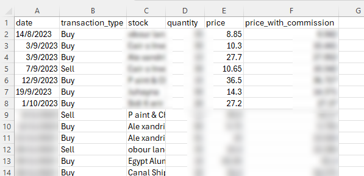

# Thndr E-Statements To CSV

This script processes thdr exported e-statement PDF files, extracts transaction details (dividends, buy/sell), and saves the results as CSV files for further analysis.

## Prerequisites

1. Python  
This script is tested and working properly with python 3.10.11 version.  

2. Install Dependencies  
Install the required Python libraries by running:

```bash
pip install -r requirements.txt
```

## Directory Structure

Place your files in the following structure:

```bash
project/
│
├── E-STATEMENTS/            # Input directory containing PDF files.
│   ├── E-STATEMENT_01_Jan_2024.pdf
│   ├── E-STATEMENT_02_Feb_2024.pdf
│   └── ...
│
├── output/                  # Output directory for CSV files.
│   └── (Generated CSVs will be saved here)
│
├── main_script.py           # This script.
├── README.md                # This README file.

```

## Output Example

Output Files After running `main.py`, two CSV files will be generated in the output folder:

- `dividend_transactions.csv`
- `buy_sell_transactions.csv`

Here is a sample output from `buy_sell_transactions.csv` file:
